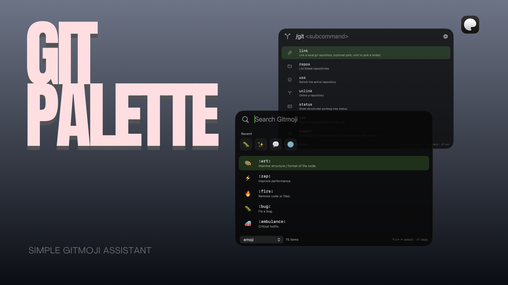

# GitPalette

macOS menu bar app for Gitmoji and a small Git launcher. Open it from the menu bar or **⌘⇧G**.

  

## Features

- **Gitmoji** — search the bundled catalog offline, copy emoji, `:code:`, or a custom template
- **Recent picks** — jump back to Gitmoji you copied last
- **`/git`** — link repos, then run `status`, `add`, `commit`, `repos`, `use`, `unlink` from the launcher
- **Commit preview** — `/git commit` plus Space or Return shows the history graph
- **Global hotkey** — default **⌘⇧G** (configurable). Accessibility is optional

Gitmoji data is bundled from [gitmoji.dev](https://gitmoji.dev/).

## Requirements

macOS 13.0+ · Xcode 15+

## License

Copyright © 2026 ZhiH2333. [AGPL-3.0](LICENSE).
