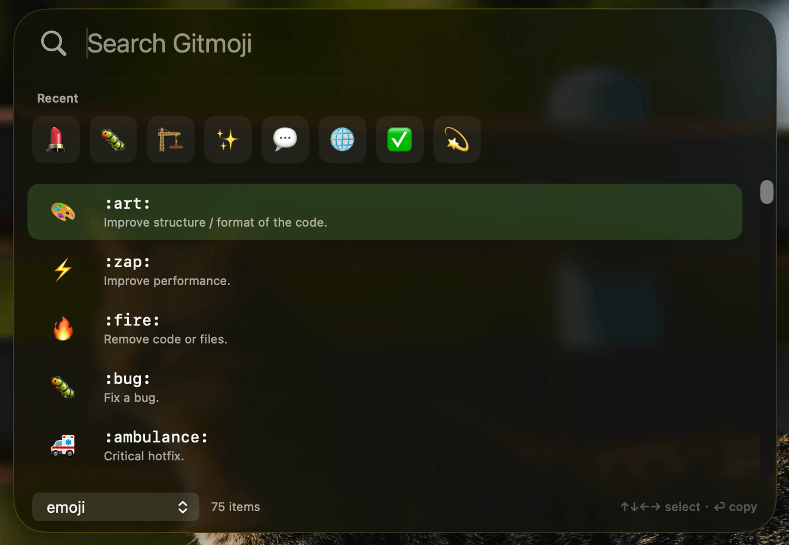

# GitPalette

**GitPalette** is a macOS menu bar Gitmoji assistant. Search, browse, and copy Gitmoji with a Spotlight-style launcher.

<p align="center">
  
</p>

## Features

- **Menu bar agent** — lives in the menu bar; launch from the palette icon or a global hotkey
- **Spotlight-style launcher** — frosted / Liquid Glass chrome with keyboard-first navigation
- **Local Gitmoji search** — fuzzy search over the bundled catalog (offline)
- **Recent picks** — quick access to recently used Gitmoji
- **Copy formats** — `emoji`, `:code:`, or a custom template (`{emoji}` `{code}` `{name}` `{description}`)
- **Global hotkey** — default **⌘⇧G** (configurable; Accessibility permission required)
- **Languages** — UI, code translation, and descriptions can use English or Simplified Chinese independently
- **Native Settings** — General, Language, and Hotkey tabs

## Gitmoji source

Official Gitmoji data is bundled from the [Gitmoji](https://gitmoji.dev/) project:

| Resource | URL |
|----------|-----|
| Website | https://gitmoji.dev/ |
| API | https://gitmoji.dev/api/gitmojis |
| GitHub | https://github.com/carloscuesta/gitmoji |

Bundled files live under `GitPalette/Resources/` (`gitmojis.json`, `gitmoji_zh.json`).

## Project structure

```text
GitPalette/
├── App/                    # App entry & window IDs
├── Core/
│   ├── Config/             # PreferencesStore, copy format, appearance, hotkey defaults
│   ├── DesignSystem/       # Glass / launcher chrome helpers
│   ├── HotKey/             # Global hotkey + Accessibility helpers
│   └── I18n/               # App language & UI strings
├── Features/
│   ├── Gitmoji/            # Domain, data (bundle repo), search UI
│   ├── Launcher/           # NSPanel launcher controller & views
│   ├── Settings/           # Native Settings tabs
│   └── AI/                 # Placeholder for future AI recommend
├── Resources/              # gitmojis.json, gitmoji_zh.json
├── Assets.xcassets/
└── GP.icon/
```

## Getting started (Xcode Debug)

### Requirements

- macOS 13.0+
- Xcode 15+ (Swift 6 / SwiftUI)
- Accessibility permission for the global hotkey

### Run in Debug

1. Open `GitPalette.xcodeproj` in Xcode.
2. Select the **GitPalette** scheme and a **My Mac** destination.
3. Press **⌘R** (Product → Run) to build and launch in Debug.
4. Grant Accessibility when prompted:  
   **System Settings → Privacy & Security → Accessibility → GitPalette**.
5. Press **⌘⇧G** (or your configured hotkey) to open the launcher.
6. Open **Settings…** from the menu bar icon to change appearance, copy format, languages, or the hotkey.

### Optional: command-line build

```bash
xcodebuild -scheme GitPalette -configuration Debug build
```

## License

Copyright © 2026 ZhiH2333.

This project is licensed under the **GNU Affero General Public License v3.0** (AGPL-3.0).  
See [LICENSE](LICENSE) for the full text.
